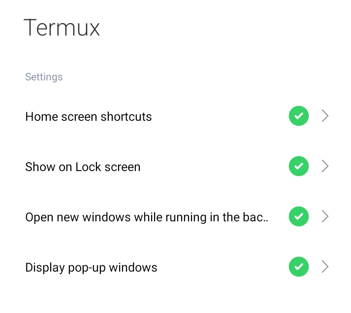

# drawercli-aurora
[](https://github.com/luisadha/drawercli-aurora/actions/workflows/build-deb.yml)
[](https://github.com/luisadha/drawercli-aurora/releases/latest)
---

## Launcher… but actually a drawer

### ⚡ Descriptions

**Drawercli (Aurora version)** is a small installer script that allows all user applications to be extracted into readable files for Termux Widget uses.

This script is designed for **Termux** and **Termux:Widget** to display the list of user applications, so they can be launched via the Termux Widget.

---

### ✨ Features

- **Minimal**  
  Installer-based script that performs its function efficiently. Installs your Termux widget and makes it operational immediately.

- **Easy**  
  Quick installation process – ready to use within minutes.

- **Alternative Launcher**  
  Lightweight replacement for commercial launchers, providing a different user experience.

---

## 🚀 Installation Methods

There are several installation methods available.

### Quick Install

To update your apps list, rerun the code below:

```bash
curl -sL https://luisadha.github.io/drawercli-aurora | sh
```

> **Tip:** You can copy the command above or use the **Share URL** option in Termux.

---

### Inspect & Install

Your trust is important — you can verify the source code first before proceeding with installation.

### Advanced Install

If you’d rather not use the usual copy-paste method, you can use the “Share URL” option.  
It just needs a bit of setup first to make this button work.

> **NOTE:**  
> For the **Share link to Termux** button to work correctly, replace the contents of:
>
> - `~/bin/termux-url-opener`
> - `~/bin/termux-file-editor`  
>
> with the code shown below.

---

## 📖 Usage

Go to your home screen and add a widget.  
Scroll down until you find the widget named **Termux**, then add it to your home screen.

---

## 🛠️ Requirements

Make sure the following applications are available on your device:

- Termux app  
- Termux:Widget app

---

## 📦 Dependencies

Ensure the following Termux packages are installed:

- `aapt`
- `curl`
- `wget`
- Standard utilities (`awk`, `sed`, `grep`, etc.) — from `coreutils` or `busybox`

---

## 🧩 Simulate code on your file

**~/bin/termux-file-editor**
```bash
nano $1 && bash $1
```

**~/bin/termux-url-opener**
```bash
url=$1; curl -L "$url" | bash
```

---

## 🔒 Termux permissions

Check Termux app permissions and approve them as shown below:

<p align="left">
  
</p>

---

## 💭 Inspired By

Please check out these previous works that inspired the creation of Drawercli Aurora 🙏

- [TUI Launcher](https://f-droid.org/id/packages/ohi.andre.consolelauncher/) — Linux CLI Launcher for Android  
- [Termuxlauncher](https://github.com/amsitlab/termuxlauncher) — Set Termux as a launcher without hacking  
- [Drawercli (Predecessor)](https://github.com/luisadha/drawercli) — CLI app for Termux to open user Android apps  

---

> **Disclaimer:**  
> This program does not transfer any information to other networked systems unless specifically requested by the user or the person installing or operating it.

---

## 📜 License

Copyright © 2024–Present  
[**Luis Adha**](https://github.com/luisadha) — under the **MIT License**
